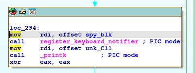
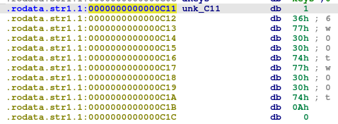

1. Who is the module's author?
`modinfo` - show information about a Linux kernel module. It extracts information from the Linux kernel modules give on the command line. By default lists each attribute of the the module in the form _fieldname : value_.
-a -d -l -p -n
	shortcuts for author, description, license, parm (parameters - can be passed to a kernel module when it's loaded; defined in the kernel module's source code using `module_param()` or `module_param_array()` macros), and filename respectively

```
┌──(intellijr㉿kali)-[~/ctfs/htbunictf24/colossalbreach/rev_colossalbreach]
└─$ modinfo brainstorm.ko
filename:       /home/intellijr/ctfs/htbunictf24/colossalbreach/rev_colossalbreach/brainstorm.ko
description:    Go on and analyze me !!!!
version:        1.0
author:         0xEr3n
license:        GPL
srcversion:     29EC7701DCAFDF45193296A
depends:        
retpoline:      Y
name:           brainstorm
vermagic:       6.1.0-26-amd64 SMP preempt mod_unload modversions 
parm:           codes:log format (0:US keys (default), 1:hex keycodes, 2:dec keycodes) (int)
```
retpoline is a software-based mitigation technique for Spectre Variant 2. 
Alternatively, `strings brainstorm.ko | grep author` works too.

2. What is the name of the function used to register keyboard events?
`register_keyboard_notifier` and `unregister_keyboard_notifier` are standard kernel functions provided by the Linux kernel input subsystem. They are defined in the _keyboard notifier chain (referred to as KNC further on cause I'm lazy)_ API in the Linux kernel. On register, a special callback function (likely `spy_cb`) must be provided to be executed whenever a keyboard event occurs.
The KNC allows kernel modules to observer keyboard events.

On keyboard event, the Linux input subsystem generates an event, that is passed to a callback, and includes the keycode and the event type (e.g. press/release), and is further processed in the callback function.

The file `logs` is not a standard kernel log file. It's likely created by the kernel module.

The answer is `register_keyboard_notifier`

3. What is the name of the function that converts keycodes to strings?
Position-Independent Code (PIC) mode is a programming technique where code is written so that it can be loaded and executed at any memory address without modification. Kernel modules often operate in PIC mode because they can be loaded into arbitrary memory locations, depending on where space is available in the kernel's address space.

Instead of using hardcoded absolute memory addresses, PIC uses relative addresses. GOT holds the addresses of global vars or functions, and the code can access the data via GOT.

`keycode_to_string` converts keycodes to strings.

4. What file does the module create to store logs?
`/sys/kernel/debug/spyyy/keys`
We can deduce the `/spyyy/keys` part from the source code of `spy_init` function. 
By default debugfs, a special-purpose Linux virtual filesystem used for debugging kernel modules, is mounted at `/sys/kernel/debug`. When debugfs is mounted, it creates a virtual root directory, and any directory/file created in debugfs is added relative to this virtual root.

5. What message does the module print when imported?
`w00tw00t`
Can be found in the read-only constants in the source code.  

  
The first byte (`0x36`, or ASCII `6`) in a printk format string specifies the log level.

6. What is the XOR key used to obfuscate the keys? (in hex)
We can probably find this out in the `keycode_to_string` function.
`0x19`

7. What is the password entered for 'adam'?
Do we look in the logs and xor everything back? Let's use Python to do xor every character in the logs with `0x19`.

The walrus operator (`<variable> := <expression>`) allows you to assign a value of expression to variable, and return the value of the expression simultaneouly (kinda like that C thing where you do `if (variable = expression) == something {...}`).

```python
xor_key = 0x19
deobf_logs = []

# read logs byte by byte
# append each byte to deobf_logs

with open("logs", "rb") as f:
    while (byte := f.read(1)):
        deobf_byte = byte[0] ^ xor_key
        deobf_logs.append(chr(deobf_byte))

for b in deobf_logs:
    print(b, end="")

```

```
ls
pwd
clear
id
whoami
cd /opt
ls
cd /root/
ls -la
echo _RSHIFT__RSHIFT__RSHIFT_"_LSHIFT__LSHIFT__LSHIFT__LSHIFT_H_LSHIFT_I_RSHIFT_" _RSHIFT__RSHIFT__RSHIFT_> hey.txt
cat hey.txt
cd /home/
ls
cd htb
ls
cd _LSHIFT_Desktop
ls
echo _RSHIFT_"yoo sup boiiii_RSHIFT_" _RSHIFT_> hello.txt
cat hello.txt
cd /root/adam
nano pass.txt
adam _RSHIFT__RSHIFT__RSHIFT__RSHIFT__RSHIFT_: _RSHIFT__RSHIFT__RSHIFT__RSHIFT__RSHIFT__RSHIFT__RSHIFT_"supers3cur3passw0rd_RSHIFT_"_LCTRL__LCTRL_xy
clear
bye bye.
```
>supers3cur3passw0rd